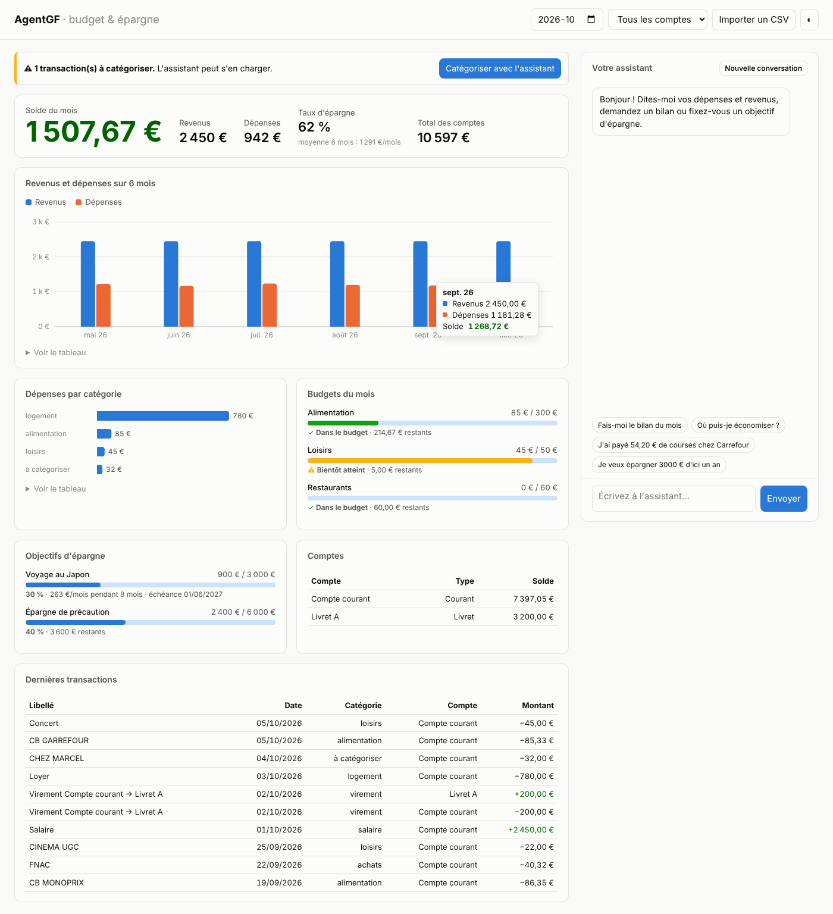
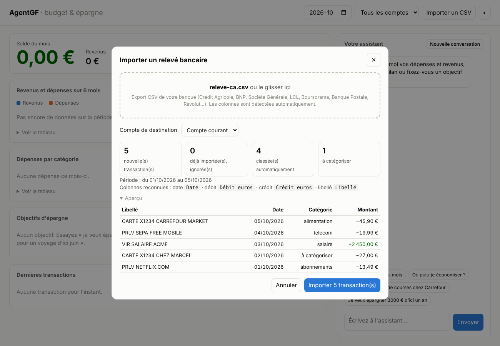

# AgentGF — agent IA de gestion de budget et d'épargne

AgentGF est un assistant conversationnel en français, propulsé par Claude, qui tient vos comptes à votre place :
vous lui parlez normalement (« j'ai payé 54 € de courses », « combien il me reste en loisirs ? »),
et il enregistre, analyse et vous conseille à partir de **vos données stockées localement** (SQLite).
Il s'utilise en ligne de commande ou via une **interface web** avec tableau de bord et graphiques.



## Fonctionnalités

| Domaine | Ce que l'agent sait faire |
|---|---|
| Comptes | Plusieurs comptes (courant, livrets, espèces…), soldes, virements internes |
| Transactions | Ajouter revenus/dépenses, lister/filtrer/rechercher, supprimer, importer un relevé CSV |
| Catégorisation | Classement automatique des libellés (règles perso, historique, enseignes connues), le reste par l'IA |
| Budgets | Plafond mensuel par catégorie, suivi du consommé/restant, alerte de dépassement |
| Analyses | Bilan mensuel (solde, taux d'épargne, répartition), tendances sur N mois |
| Épargne | Objectifs avec échéance et effort mensuel nécessaire, versements/retraits |
| Simulation | Projection à intérêts composés (versement mensuel, taux annuel, durée) |

## Installation

```bash
pip install -e ".[dev]"
export ANTHROPIC_API_KEY=sk-ant-...
```

## Utilisation

```bash
agentgf --web                # interface web sur http://127.0.0.1:8000
agentgf                      # mode interactif en terminal
agentgf -v "Fais-moi le bilan du mois"   # message unique, appels d'outils affichés
agentgf --db ./mon-budget.db # base personnalisée (défaut : ~/.agentgf/budget.db, ou $AGENTGF_DB)
```

Exemple de session :

```
vous › Je touche 2400 € de salaire par mois, fixe-moi un budget alimentation de 350 €
vous › J'ai dépensé 62,30 € chez Carrefour hier
vous › Je veux mettre 3000 € de côté pour un voyage avant juin 2027
vous › Si je place 150 € par mois à 3 % pendant 10 ans, j'aurai combien ?
```

### Interface web

`agentgf --web` ouvre un tableau de bord local : solde et taux d'épargne du mois, revenus/dépenses sur
6 mois, dépenses par catégorie, jauges de budgets et d'objectifs, comptes et dernières transactions,
avec le chat de l'assistant à côté. Filtres par mois et par compte, import CSV par bouton, thème clair/sombre.

Le navigateur s'ouvre automatiquement (`--no-browser` pour l'éviter). **Laissez le terminal ouvert**
pendant l'utilisation, et n'ouvrez pas `index.html` en double-cliquant dessus : la page a besoin du
serveur pour fonctionner. En cas de souci, le message d'erreur s'affiche en haut du tableau de bord et
le détail technique dans le terminal.

Le serveur n'a pas d'authentification : il écoute sur `127.0.0.1` uniquement et refuse les requêtes
d'autres origines. N'utilisez `--host 0.0.0.0` que sur un réseau de confiance.

### Plusieurs comptes

« Crée un Livret A avec 2000 € », « vire 200 € du compte courant vers le Livret A ».
Les virements internes ne comptent ni comme revenus ni comme dépenses dans les bilans.

### Importer un relevé bancaire (CSV)

1. Dans l'espace en ligne de votre banque, exportez vos opérations au format **CSV** (parfois appelé
   « Excel » ou « tableur »).
2. Dans l'interface web, cliquez sur **Importer un relevé** ou glissez le fichier n'importe où sur la page.
3. Choisissez le compte de destination, vérifiez l'aperçu, puis validez.



Les colonnes sont détectées automatiquement, quelle que soit la banque : lignes d'information avant le
tableau, encodage UTF-8 ou Windows, séparateur `;` `,` ou tabulation, dates `JJ/MM/AAAA` ou ISO,
montant signé ou colonnes **Débit / Crédit**, montants `1 234,56 €`. Testé sur des exports au format
Crédit Agricole, BNP Paribas, Société Générale, Boursorama et Revolut.

Vous pouvez réimporter un relevé qui chevauche le précédent : les transactions déjà présentes sur le
compte sont reconnues et ignorées. En terminal, demandez simplement à l'agent
« importe ~/Téléchargements/releve.csv sur le Livret A ».

Les lignes sans catégorie sont classées automatiquement, dans cet ordre :
1. vos règles (« classe toujours *Chez Marcel* en restaurants ») ;
2. l'historique : un libellé identique déjà classé ;
3. une liste d'enseignes françaises courantes (Carrefour, SNCF, Netflix, Doctolib…).

Ce qui reste « à catégoriser » est classé par l'assistant, qui peut créer des règles pour les prochains imports.

## Architecture

```
agentgf/
├── agent.py       # boucle agentique Claude (tool use, thinking adaptatif, fallback sur refus)
├── tools.py       # outils métier + schémas JSON stricts exposés au modèle
├── csv_import.py  # lecture des relevés CSV des banques
├── categorize.py  # catégorisation automatique des libellés
├── db.py          # schéma SQLite (+ migration des bases 0.1)
├── web.py         # serveur web local (bibliothèque standard)
├── static/        # tableau de bord (HTML/SVG, sans dépendance externe)
└── cli.py         # interface en ligne de commande
```

L'agent utilise `claude-opus-5-5` (modifiable via `--model`), effort `medium` par défaut (`--effort`),
et le paramètre `fallbacks: "default"` pour qu'une requête refusée soit reprise automatiquement par un modèle de repli.

## Tests

```bash
pytest
```

Les tests couvrent les outils métier, la catégorisation, la migration, le serveur web et la boucle agentique
(avec un client simulé, sans appel réseau).

> AgentGF fournit des repères pédagogiques, pas un conseil en investissement personnalisé.
